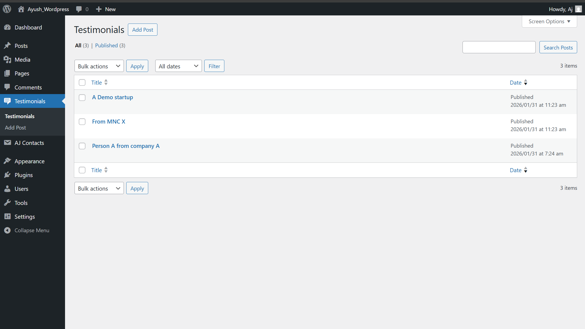

An advanced WordPress plugin that manages testimonials using a custom post type, admin meta fields, frontend shortcodes, and a REST API endpoint.

### Features

Custom Post Type (aj_testimonial)

Admin meta boxes for client name & rating

Secure data saving with nonces & capability checks

Frontend shortcode [aj_testimonials]

REST API endpoint for headless usage

Gutenberg-compatible content rendering

### Tech Used

PHP

WordPress Plugin API

Custom Post Types

WP_Query

REST API

Meta Boxes

Nonces & Sanitization

##  Screenshots

### Admin – Testimonials Manager

### Meta Box Editor

### Frontend Rendering

### REST API Output

### Installation (Local)

Clone into:

wp-content/plugins/

Activate plugin from WordPress Admin.

Add testimonials from Testimonials menu.

Display on any page using:

[aj_testimonials]

Access API:

/wp-json/aj/v1/testimonials

### What I Learned

WordPress plugin architecture

Custom Post Types & rewrite rules

Admin UI & meta fields

Secure data handling

Shortcodes & frontend rendering

Exposing data via WordPress REST API
